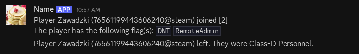

# Webhook join logs
A simple plugin using EXILED to log player connections to a Discord webhook.
Additionally the plugin checks a few basic things about the player such as RA access or DNT and presents it as 'flags'.

Default config:
```yaml
is_enabled: true
debug: false
webhook_url: ""
joined: "Player %name% (%steamid%) joined [%id%]"
left: "Player %name% (%steamid%) left. They were %class%."
flags: "The player has the following flag(s): "
show_flags: true
log_leaves: true
```
The plugin parses `%name%`, `%steamid%`, `%id%` & `%class%` to show appropriately

Example:


